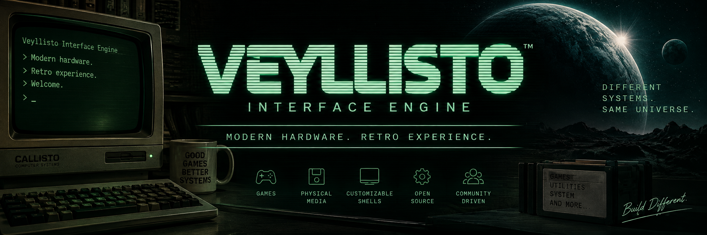
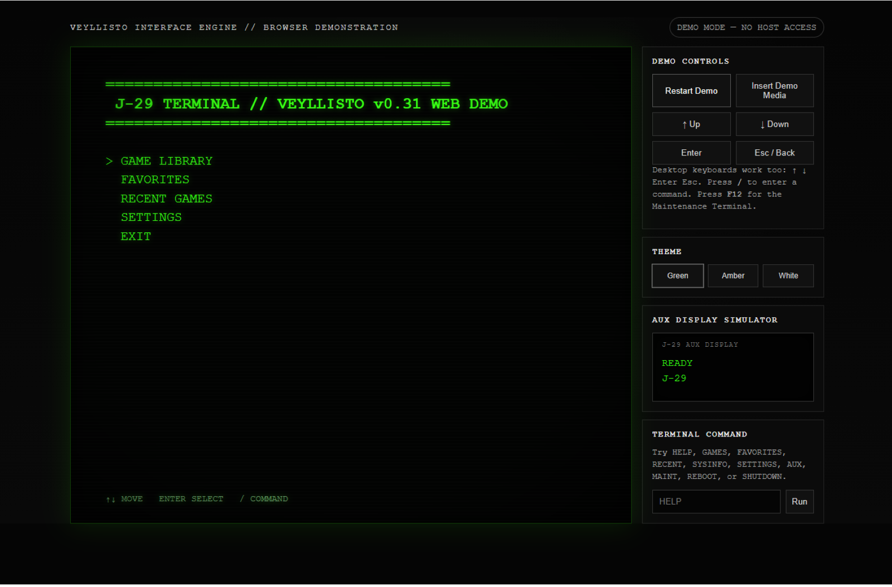
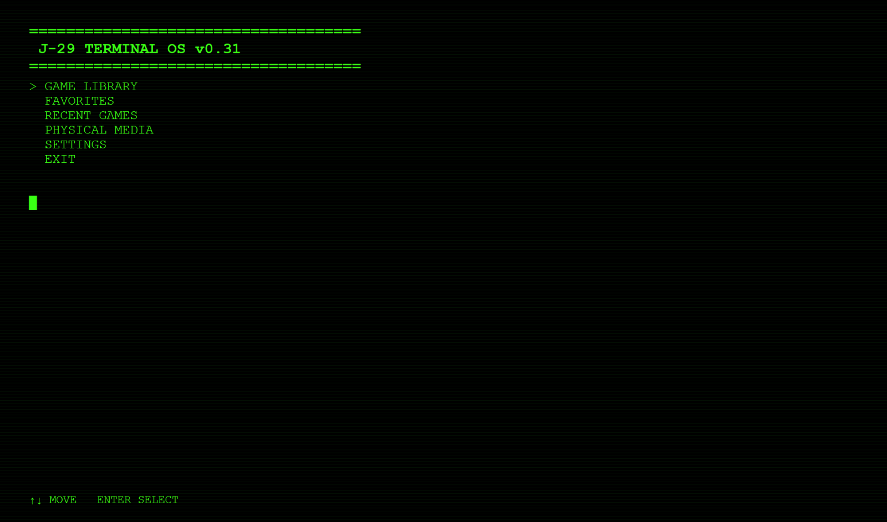
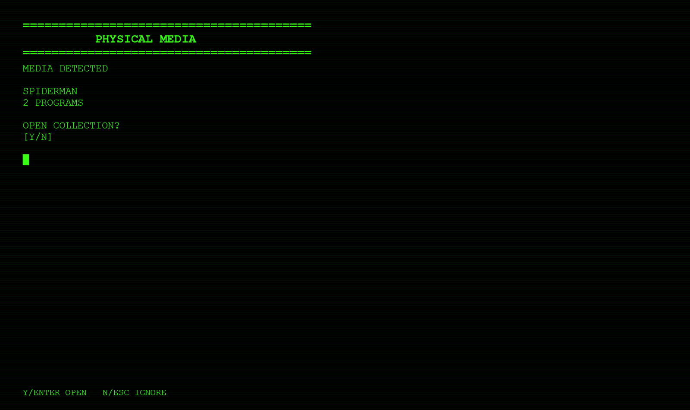
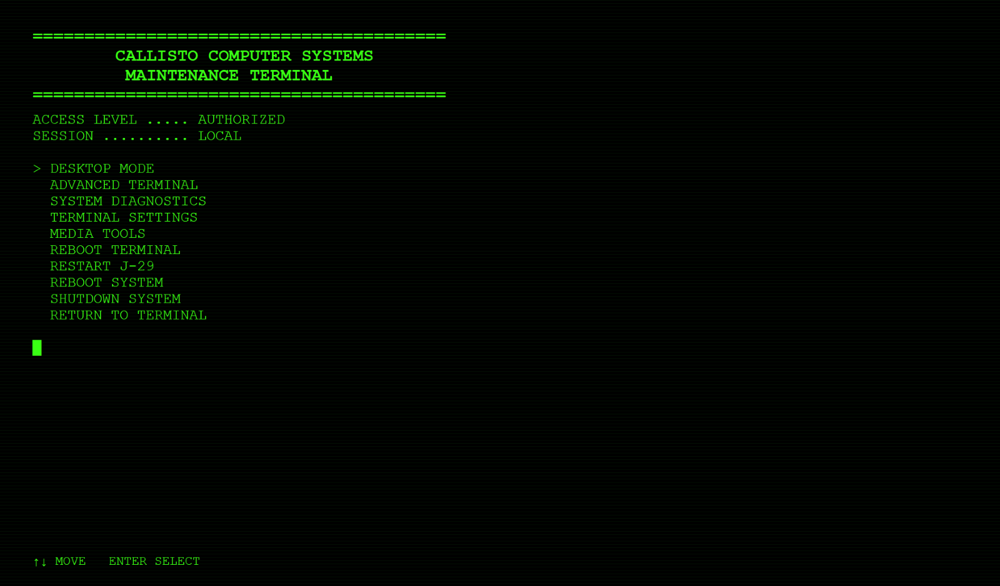
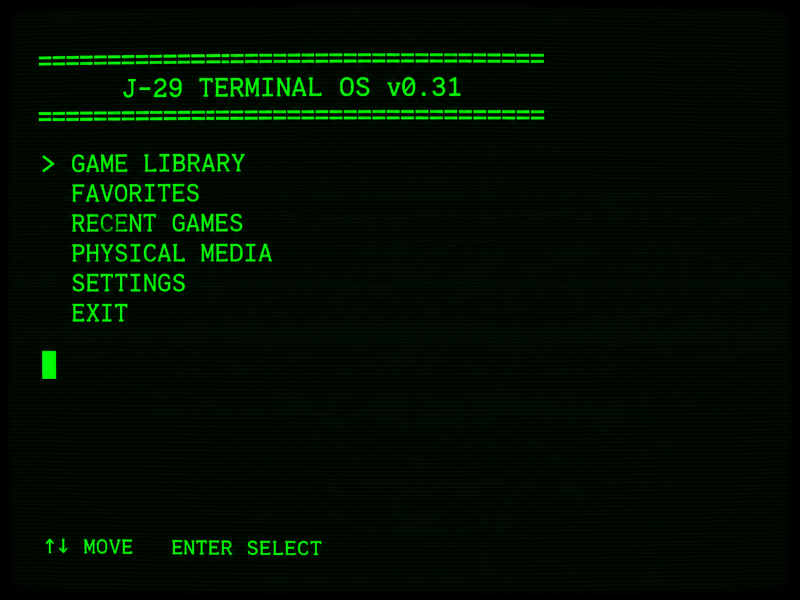
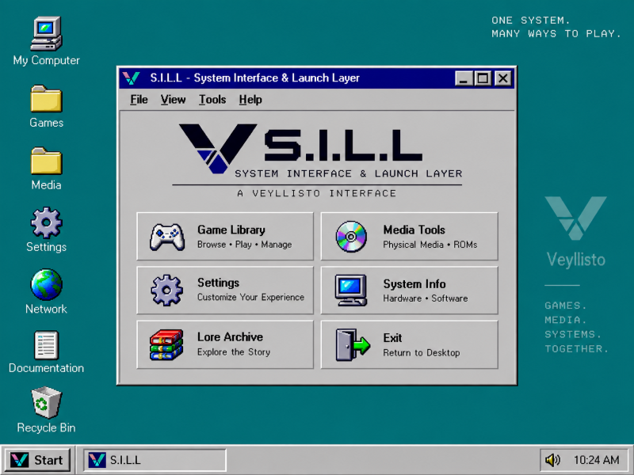
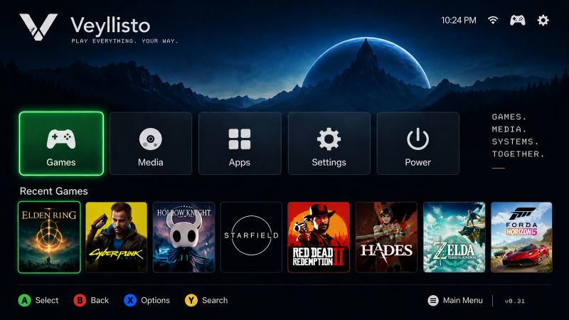
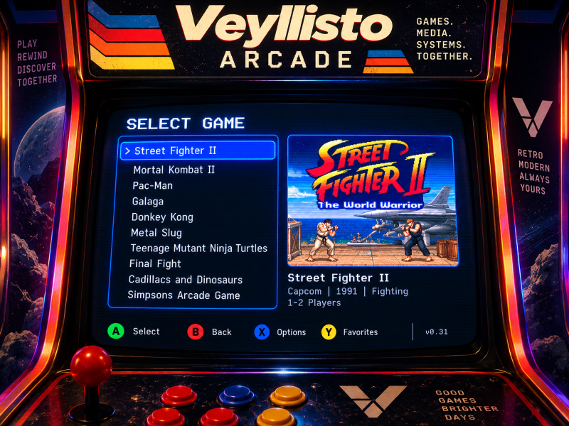

<p align="center">
  
</p>

<h1 align="center">Veyllisto Interface Engine</h1>

<p align="center">
  <strong>Modern hardware. Retro experience.</strong>
</p>

<p align="center">
  A modular retro-computing interface engine for games, physical media, fictional computer systems, and interchangeable interface shells.
</p>

<p align="center">
  <a href="https://veyllisto.com/"><strong>Website</strong></a>
  &nbsp;•&nbsp;
  <a href="https://veyllisto.com/demo/"><strong>Live Browser Demo</strong></a>
  &nbsp;•&nbsp;
  <a href="ROADMAP.md"><strong>Roadmap</strong></a>
</p>

<p align="center">
  
  
  
  
  
</p>

---

## Try Veyllisto Before You Download

Veyllisto has a browser-based interactive demo that lets you experience the interface without installing anything.

<p align="center">
  <a href="https://veyllisto.com/demo/">
    
  </a>
</p>

The demo includes:

- Animated terminal boot
- Categorized Game Library
- Favorites and Recent Games
- Simulated Physical Media
- Callisto Green, Amber, and White themes
- Auxiliary Display simulator
- Settings
- Maintenance Terminal
- Advanced Terminal demonstration

> The browser demo is a safe simulation and does not access the visitor's files, Steam library, USB devices, or host operating system.

---

## What Is Veyllisto?

Veyllisto is not intended to be another conventional game launcher.

It is an attempt to make modern hardware feel like a **dedicated fictional computer system** again.

Instead of exposing separate launchers, emulator folders, ROM directories, removable drives, and desktop shortcuts directly to the user, Veyllisto places them behind a unified Engine and lets interchangeable Shells determine how that system feels.

> **One Engine. Shared state. Multiple experiences.**

---

## Current Reference Experience

<p align="center">
  
</p>

The current first-party reference experience is the **Veyllisto Terminal**, built from the original Callisto-inspired terminal project.

Current systems include:

- Unified Game Library
- Steam integration
- Emulator / ROM launching
- Favorites and Recently Played
- Game metadata
- Physical-media detection
- Metadata-only launch keys
- Self-contained physical game media
- Multi-game physical collections
- Built-in Physical Media Creator
- Safe removable-media writing and verification
- Auxiliary-display support
- Theme-owned semantic audio
- Configurable machine identity
- Authenticated Maintenance Terminal
- Advanced Terminal
- Controlled Desktop Mode
- Process-level Veyllisto restart
- Protected host reboot / shutdown actions

---

## Physical Media

Physical media is one of Veyllisto's defining systems.

> **Physical media represents software. It does not require the software to physically reside on that media.**

<p align="center">
  
</p>

A removable device can act as:

- A metadata-only game key
- A self-contained game medium
- A multi-game collection
- A reusable physical representation of software already installed elsewhere

The built-in **Physical Media Creator** lets users generate compatible media from inside Veyllisto without manually looking up internal game IDs.

---

## Maintenance Terminal

<p align="center">
  
</p>

The authenticated Maintenance Terminal provides controlled access to:

- Desktop Mode
- Advanced Terminal
- System Diagnostics
- Terminal Settings
- Media Tools
- Reboot Terminal
- Restart Veyllisto
- Host reboot / shutdown confirmation
- Return to normal operation

Maintenance access is intentionally separate from the normal user experience.

---

## Veyllisto v1.0 Shell Suite

Veyllisto v1.0 is planned to ship with four first-party interface Shells.

<table>
<tr>
<td align="center" width="25%">
<br>
<strong>Terminal</strong><br>
Keyboard-first immersive retro terminal
</td>
<td align="center" width="25%">
<br>
<strong>Classic Desktop</strong><br>
Late-80s / early-90s graphical desktop
</td>
<td align="center" width="25%">
<br>
<strong>Living Room</strong><br>
Controller-first television / couch experience
</td>
<td align="center" width="25%">
<br>
<strong>Arcade</strong><br>
Cabinet-style game-first experience
</td>
</tr>
</table>

Shell concept previews — final interfaces may change before v1.0.
All four Shells use the same underlying Veyllisto Engine and shared state.

A user should not need separate game libraries, favorites, metadata, emulator configuration, or recent history for every interface.

---

## Architecture

```text
                    VEYLLISTO
                 INTERFACE ENGINE
                        │
        ┌───────────────┼───────────────┐
        │               │               │
        ▼               ▼               ▼
      SHELLS          THEMES         IDENTITY
        │
        ▼
  ┌─────┼────────┬───────────┐
  │     │        │           │
  ▼     ▼        ▼           ▼
TERM  DESKTOP  LIVING      ARCADE
                ROOM
        │
        └──────────────┐
                       ▼
                 SHARED ENGINE
                 ├─ Library
                 ├─ Metadata
                 ├─ Steam
                 ├─ Emulators
                 ├─ Favorites
                 ├─ Recents
                 ├─ Physical Media
                 ├─ Configuration
                 ├─ Audio
                 ├─ Auxiliary Display
                 └─ Maintenance Services
```

The Engine owns shared functionality. Shells control presentation and interaction.

---

## Project Status

**Latest completed milestone:** `v0.31 — Maintenance Terminal`  
**Next development milestone:** `v0.32 — Guided First-Launch Setup`  
**Primary release target:** Windows  
**License:** MIT

### Road to v1.0

| Version | Milestone | Status |
|---|---|---|
| v0.29.0 | Physical Media Creator | ✅ Complete |
| v0.30 | OLED / Auxiliary Display Support | ✅ Complete |
| v0.31 | Maintenance Terminal | ✅ Complete |
| v0.32 | Guided First-Launch Setup | 🚧 Next |
| v0.33 | Appliance Mode | ⏳ Planned |
| v0.34 | Boot Maintenance Console | ⏳ Planned |
| v0.35 | Deployment Build | ⏳ Planned |
| v0.36 | Classic Desktop Shell | ⏳ Planned |
| v0.37 | Living Room Shell | ⏳ Planned |
| v0.38 | Arcade Shell | ⏳ Planned |
| v0.39–v0.99 | Shell Integration, Polish & Stabilization | ⏳ Planned |
| v1.0 | Initial Public Release | 🎯 Target |

See the full [`ROADMAP.md`](ROADMAP.md).

---

## Repository Structure

```text
Veyllisto-Interface-Engine/
│
├── engine/
├── shells/
├── themes/
├── config/
├── assets/
│   ├── branding/
│   ├── screenshots/
│   ├── shells/
│   └── demo/
│
├── README.md
├── ROADMAP.md
├── ARCHITECTURE.md
├── CONTRIBUTING.md
├── PROJECT_HISTORY.md
└── LICENSE
```

---

## Open Source

Veyllisto Interface Engine is open source under the **MIT License**.

Contributions may include:

- Bug fixes
- Documentation
- Themes
- Community Shells
- Emulator profiles
- Platform compatibility
- Hardware builds
- Accessibility improvements
- Testing
- Feature ideas that fit the roadmap

See [`CONTRIBUTING.md`](CONTRIBUTING.md).

---

## Links

- **Website:** https://veyllisto.com/
- **Live Demo:** https://veyllisto.com/demo/
- **Roadmap:** [`ROADMAP.md`](ROADMAP.md)
- **Architecture:** [`ARCHITECTURE.md`](ARCHITECTURE.md)
- **Contributing:** [`CONTRIBUTING.md`](CONTRIBUTING.md)

---

<p align="center">
  <strong>Modern hardware. Retro experience.</strong>
</p>

<p align="center">
  <em>Big vision. Small versions. Stable checkpoints. No chaos.</em>
</p>
